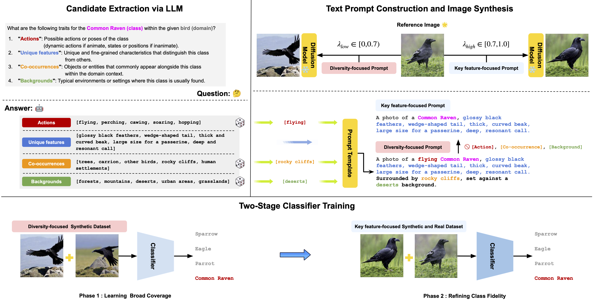

# CABIN: Controlling Augmentations for Balancing Invariance and Diversification in One-Shot Image Classification

<div align="center">
    
</div>

```plain
Code will be updated soon.
```

## Acknowledgements

This repository has been built drawing inspiration from the codebases of [DA-Fusion](https://github.com/brandontrabucco/da-fusion) and [DALDA](https://github.com/kkyuhun94/dalda). Utilizing this code requires adherence to their respective licensing agreements.